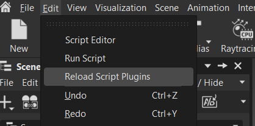
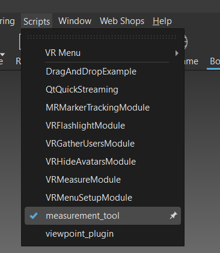
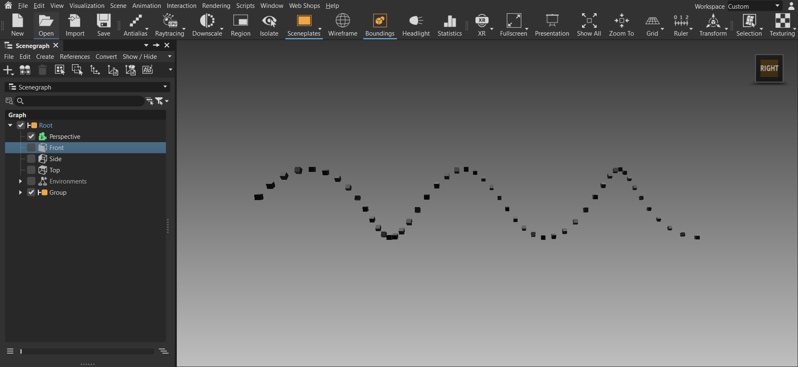
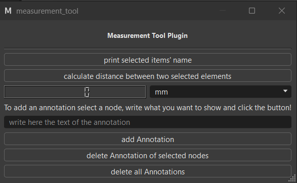

# Measurement Tool Plugin for VRED
This is a Qt Pyside6 plugin for VRED 17.3 application.
The only purpose of this plugin is to learn how to create (and make them work) plugins for VRED application using PySide6 and get familiar with VRED API.

## Where to place the plugin and how to load/reload it

The folder must be placed in the VRED plugins directory, usually located at:
```C:\Program Files\Autodesk\VRED-17.3\ScriptPlugins```

If any modification is made to the code, the plugin must be reloaded in VRED for the changes to take effect. To do that:


After that the plugin will appear in the Plugins menu:


## Main scene to test the plugin
I have used the scene (with very few adjustments) taken from this tutorial:
[Autodesk VRED Python Tutorial — VRED Pro (2022)](https://help.autodesk.com/view/VREDPRODUCTS/2022/ENU/?guid=VRED_Tutorials_Python_Tutorials_7Tutorial_VREDPro_html).
The code is the following:
```python
    from PySide6.QtGui import QVector3D

    # Delete 'Group' node if it exists
    groupNode = vrNodeService.findNode("Group")
    if groupNode:
        deleteNode(groupNode)

    numberOfBoxes = 50
    boxSize = 50
    xStep = 125
    xRotationStep = 20
    z = 500
    radius = 400

    # Create a new group
    boxGroup = createNode("Group")

    for i in range(numberOfBoxes):
        # Create a box
        box = vrNodeUtils.createBox(boxSize, boxSize, boxSize, 1, 1, 1, 0, 0, 0)
        box.setName(f"box {i}")
        boxGroup.addChild(box)

        # Get the node of type vrdGeometryNode
        boxNode = vrNodeService.getNodeFromId(box.getID())

        # Position
        boxTranslation = QVector3D(xStep * i, 0, z)
        boxNode.setTranslation(boxTranslation)

        # Progressive scaling
        boxScale = boxNode.getScale() * (1 + (i * 0.01))
        boxNode.setScale(boxScale)

        # Rotation
        boxLocalRotation = QVector3D(xRotationStep * i, 0, 0)
        boxNode.setRotationAsEuler(boxLocalRotation)

        # Pivot for world rotations
        boxNode.setWorldRotatePivot(QVector3D(0, 0, 0))
        boxNode.setRotatePivotTranslation(QVector3D(0, 0, z + radius))
```

How the scene looks like:


## Design of the interface of the plugin

The graphical design of the interface has been created using Qt Designer. 
The .ui file is saved in the MeasurementTool folder after each modification. This is an xml file that describes the interface.

## Plugin functionality

This is how the plugin shows up in VRED:

### UI mapping → behavior

- `button_stampa_nomi`
    - Connected method: onButtonStampaNomi()
    - Action: reads the current scene selection (vrNodeService.getSelectedNodes()) and prints the selected nodes' names to the VRED console. If nothing is selected, prints an informational message.

- `button_calcola_distanza`
    - Connected method: onButtonCalcolaDistanza()
    - Action: requires exactly 2 selected nodes. Computes the Euclidean distance between their world translations (QVector3D) using distanceToPoint(). The result is stored in self.distance_mm (units: mm) and displayed on the LCD converted to the currently selected unit.

- `lcdNumber`
    - Purpose: displays the numeric distance value.
    - Updated by: _refresh_display(d) — converts the value from millimeters to the selected unit and shows the value rounded to two decimals.

- `unit_comboBox`
    - Options: mm, cm, m
    - Connected method: onUnitChanged() — triggers a display refresh based on self.distance_mm.

- `annotation_text_edit`
    - Purpose: text input for the annotation content. If empty, the node name is used as annotation text.

- `btn_add_annotation`
    - Connected method: onAddAnnotation()
    - Action: for each selected node creates an annotation via vrAnnotationService.createAnnotation(), associates it with the node, and places it with a vertical offset (default 200 mm). Returns the number of annotations created.

- `btn_delete_annotations`
    - Connected method: onRemoveAnnotations()
    - Action: removes annotations associated with the selected nodes using vrAnnotationService.getAnnotations() and vrAnnotationService.deleteAnnotations().

- `btn_delete_all_annotations`
    - Connected method: onDeleteAllAnnotations()
    - Action: shows a confirmation dialog; if confirmed, deletes all annotations. Informational messages are shown with QMessageBox.